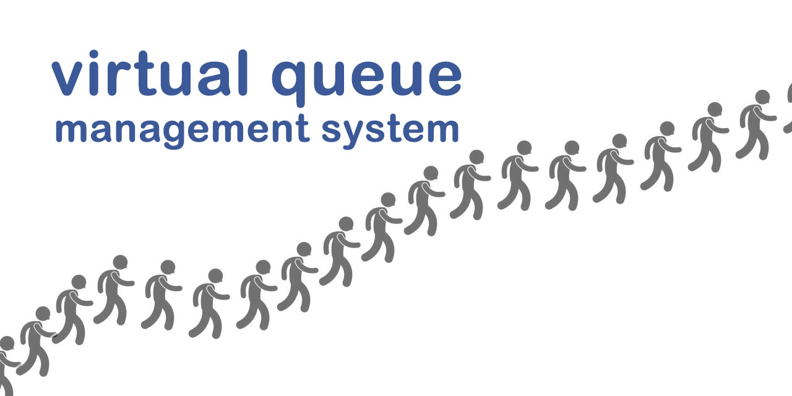
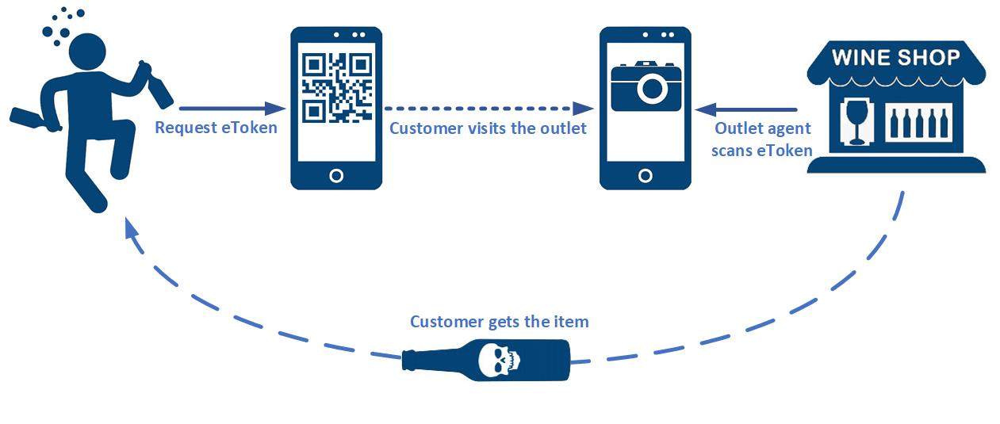
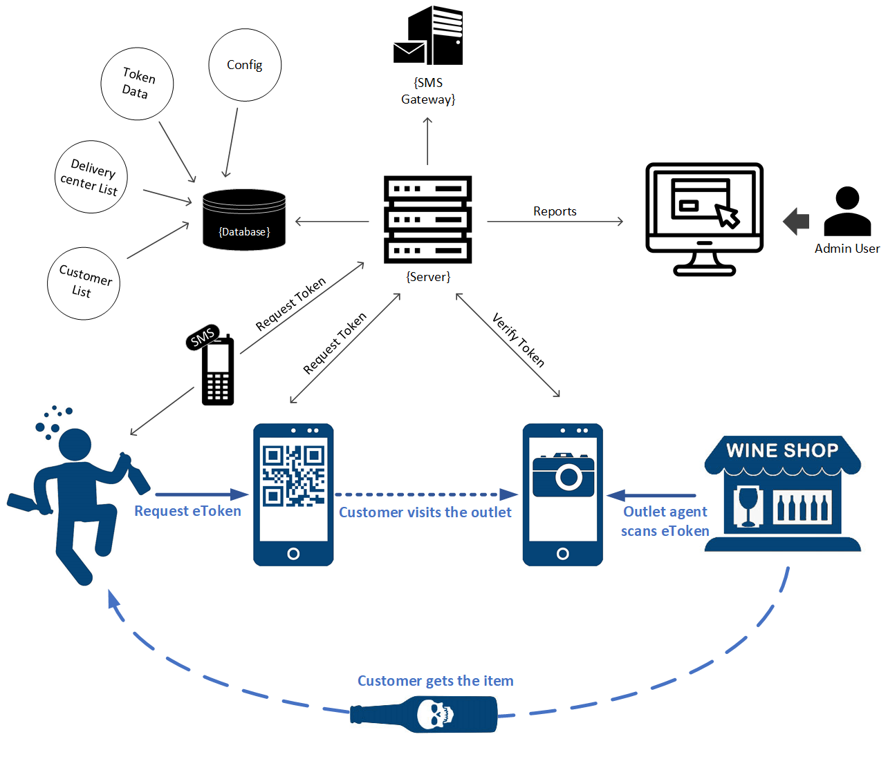
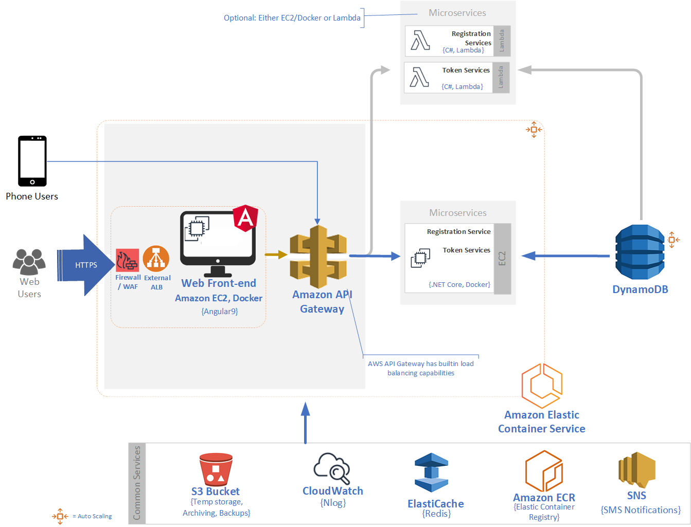

# Virtual Queue Management System
This *technical whitepaper* is an attempt to design an architecturally near perfect virtual queue application.

## Background
During the [Corona virus pandemic](https://en.wikipedia.org/wiki/COVID-19_pandemic) lockdown in 2020, [Kerala State Beverages Corporation Limited](https://www.ksbc.kerala.gov.in/), aka KSBC decided to introduce a virtual queue system, a mobile app to resume the sale of Liquor, Beer and Wine but also same time making sure the state wide lockdown protocol is followed, especially the social distancing part. But due to various reasons the said mobile app became a [fiasco](https://english.manoramaonline.com/news/kerala/2020/05/28/faircode-bevq-kerala-state-beverages-corp-glitches.html) (as on 30 May 2020).

As a citizen & netizen, and more over a technology enthusiast, I was following all the news coming out and was closely monitoring the technology aspects or views shared by mainstream and social media, and also the comments posted by the readers. There were logical as well as illogical comments from both the app developers as well as readers. This triggered me to think *why an app, which sounds simple, but became a mess* for the entire State of Kerala.

## Context & Intention
Definitely, political side of the problem is not my problem. Intention of this paper is to design a simple, but scalable Virtual Queue system.

Finally, I am making this whitepaper public, under MIT License so the public can refer the design to develop their own applications. And also, contribute suggestions & corrections so we can improve this paper.

## Table of Contents
1. Requirements Gathering & Analysis
2. High Level Solution Design
3. Deployment Architecture

## Requirements

I have tried to find exact requirements for the application, but had to do some guesswork due to unavailability of formal information. I have to depend on:
* KSBC Notice dt. 19.05.2020 [[Reference - UNDERTAKING.pdf](http://www.ksbc.kerala.gov.in/NOTICE/UNDERTAKING.pdf)]
* KSBC Guidance dt. 23.05-2020 [[Reference - GUIDELINES.pdf](https://www.ksbc.kerala.gov.in/NOTICE/GUIDLINES.pdf)]
* App functionalities mentioned in news by mainstream media, and common sense

There was a mention in media about a *implementation document* and a *proposal document* but however I did not get those so, let me build my own simple requirement set.

### Disclaimer
> This Virtual Queue app has NO relation with KSBC's Bev Q App. Though the high level concept is same as any virtual queue app, the requirement discussed in this paper is a newly brainstormed one on a generic view point.


### **Requirements Assumptions**

 A Virtual Queue Token generator application - which should support iPhone, Android and a responsive website.


- SMS based Virtual Queue Token generator, which is primarily intended for classic mobile (non-smartphone) users, but smartphone users also can use this as an alternate method.
  - There is no mention anywhere in the reference documents that App need to be a website, iPhone, Android, or a tablet variant. 
- A token validator application for the Bars & outlets
- An admin management console, which can:
  - Take Reports
  - Change token generator Schedule 
  - CRUD for Bars and outlets
- High Level Use Case
  1. User visits the App*
  2. User enters the postal [pin code](https://en.wikipedia.org/wiki/Postal_Index_Number)
  3. User gets a eToken with a schedule. The venue is expected to be within 10 KM range
  4. User, as per the timeslot given, goes to the allotted venue - Bar or outlet
  5. Bartender, using his mobile app scans the user's eToken, or enters the eToken received as SMS 
  6. Server validates the authenticity of the eToken
  7. User buys the beverage of his choice

## Layman's view:

For a layman, a drunkard will request for a token in the mobile phone and he visits the nearby liquor outlet, shows token on the mobile phone screen which the bartender will be verifying with bartender's phone and, the liquor of choice will be sold to the customer. 



## Requirements Analysis
Let us think from a Business Analysis/Business Architecture point of view.

Additional problems in Hand:
1. Token needs to be auto generated and make sure no two customers gets the same token.
2. Bartender should be able to verify the authenticity of the token so, some information exchange needs to happen. A server will be required.
3. An inventory should be maintained and various reports need to be generated by admin users
4. As per policy, the customer should not be able to buy again within N number of days (eg. 4 days)
5. Customer should be allotted a outlet within 10 kilometers range. So there needs a logic to measure the distance between customer and the outlet.
6. Needs a database of Bars, Beer & Wine parlors, and any other outlets

Performance benchmarks for solution:
7. It is expected to have max. 2,00,000 simultaneous customers on the first day, and 1,00,000 users after that. (Some sample assumptions)
8. It is expected to have approx. 10,00,000 customers per day generating the app. 

```diff
- Note: Detailed Requirement gathering and analysis is not much a scope of this paper. Only a basic requirements building activity is done here which is necessary for building the technical solution architecture.
```
Thus the next level diagram will be like this:



Here is a bird's eye view pseudo code for the application:
```java
    public static void main(String[] args) {

        // New Customer wants to buy a bottle
        Customer customer = new Customer();

        // STEP 1 - Customer Registration
        customer.RegisterMe("+919999999999", PhoneType.APP ); // App or SMS?

        // Assuming Registration successful

        // STEP 2 - Customer requests the token using a mobile app, or by sending SMS
        String CustomerToken =  customer.giveMeAToken("695000"); // Pin code

        if (CustomerToken != null) {
            //  Assuming Customer gets the token and he goes to the Outlet
            System.out.println("Show this token: " + CustomerToken + " at [this outlet] on [date]");
        } else {
            // Seems there are no slots available, or some other reason Try again later.
            System.out.println("Better luck next time!");

            return;
        }

        // STEP 3 - At the Outlet, sales guy is scanning the token
        Boolean OutletVerification = new Outlet().isTheTokenShownByCustomerValid(CustomerToken);

        if (OutletVerification) {
            // Assuming the validation is success
            System.out.println("Customer says: Wow, I got the bottle!");
        } else {
            System.out.println("Sales guy says: Get lost!");
        }
    }

// ***** ***** ***** ***** ***** ***** ***** ***** ***** ***** 
// Behind the screen

    public enum PhoneType { APP, SMS };

    private static class VQServer {
        // Database
        public String[] tokenDB = { "A", "B","C","D","E" };
        public String[] Outlets = {"Outlet1", "Outlet2", "Outlet3"};

        public void registerCustomer(String phoneNumber, PhoneType phonetype) {
            // Register customer

        }
        public String requestNewTokenByCustomer(String pinCode) {
            // Logic for - Token generation 
            // Logic for - Find nearest outlet using pinCode

            // Send token by SMS if PhoneType is SMS

            return "C"; // Sample token
        }

        public Boolean validateTokenByOutlet(String token) {
            return Arrays.asList(tokenDB).contains(token); // Validate
        }
    };

    static VQServer vqServer = new VQServer();

    private static class Customer {

        public String giveMeAToken(String pinCode) {
            return vqServer.requestNewTokenByCustomer(pinCode);
        }
        public void RegisterMe(String phoneNumber, PhoneType phonetype) {
            // Customer Registration
            vqServer.registerCustomer(phoneNumber, phonetype);
        }
    }
    private static class Outlet {
        public Boolean isTheTokenShownByCustomerValid(String token) {
            return vqServer.validateTokenByOutlet(token);
        }
    }
```

## Technical Analysis & Solutioning
We have now in hand the functional requirements. Let us list down few major non-functional requirements.

1. Scalability - Number of hits matters
2. Availability - Should work all time
3. Security - People should not cheat
4. User friendly - There is no discrimination between Drunkards
5. Auditability - Any transaction should be transparent
6. Extensibility - Requirements are Agile today
7. Fault Tolerance - failures are not acceptable
8. Performance - Most drunkards are impatient
9. Quality - No compromise

An enterprise grade solution is what is being showcased here.

### High Level generic deployment diagram
Cloud hosting is considered in the solution because of load and cost constraints inconsideration. Same solution can be workable in On-premise as well with minor technical decision changes if the expected load is less.

> Remember that there is always another better option for any better option. So whatever technical solution showcased here are just one way to do it. We can expand or cut short according to the real world scenarios.


#### AWS / Amazon Web Services Solution:


#### Microsoft Azure Solution (pending):
